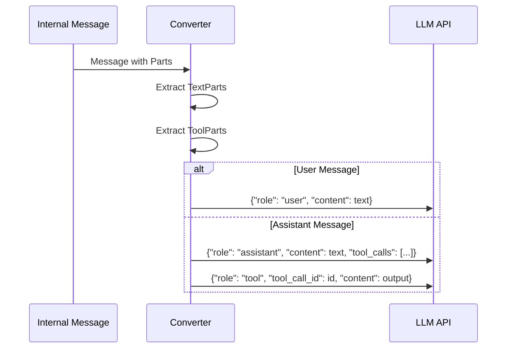
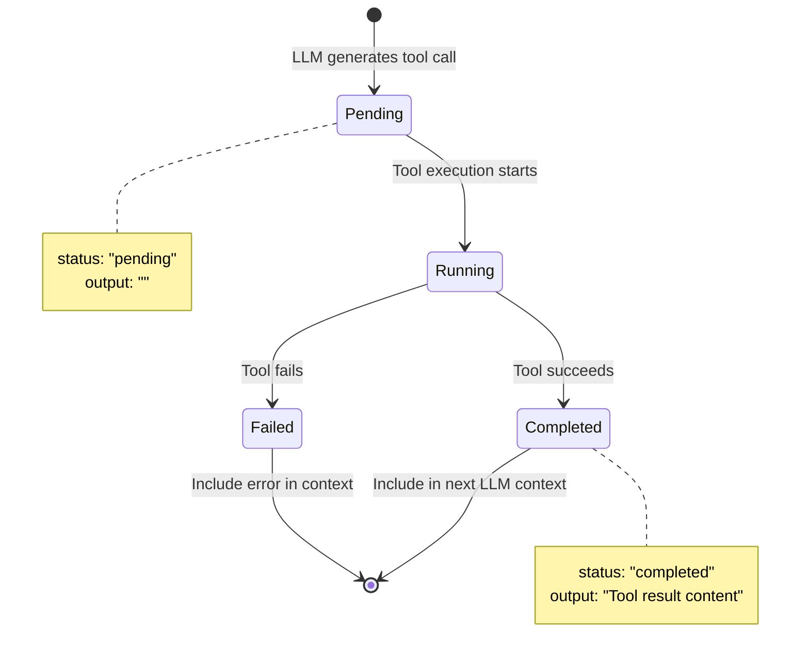
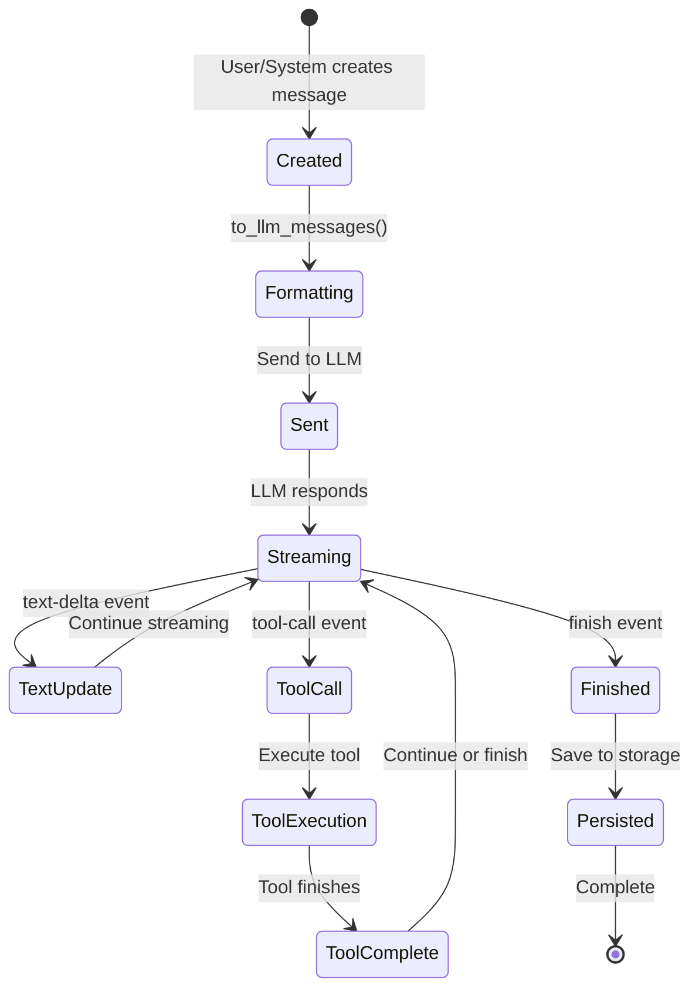

# Wolo LLM Message Structure Documentation

## Table of Contents

1. [Overview](#overview)
2. [Internal Message Structure](#internal-message-structure)
3. [LLM API Message Format](#llm-api-message-format)
4. [Message Conversion Process](#message-conversion-process)
5. [Message Types and Examples](#message-types-and-examples)
6. [Tool Call Flow](#tool-call-flow)
7. [Complete Conversation Examples](#complete-conversation-examples)
8. [Special Features](#special-features)
9. [Message Processing Pipeline](#message-processing-pipeline)

## Overview

Wolo uses a **dual-layer message architecture** that separates internal representation from LLM API format:

1. **Internal Layer**: Rich, structured messages with Parts system for persistence and processing
2. **API Layer**: OpenAI-compatible format for LLM communication

```mermaid
flowchart TD
    A[User Input] --> B[Internal Message Structure]
    B --> C[Message Storage]
    B --> D[to_llm_messages()]
    D --> E[LLM API Format]
    E --> F[GLM Client]
    F --> G[Streaming Response]
    G --> H[Internal Message Update]
    H --> C
```

## Internal Message Structure

### Core Data Types

```python
@dataclass
class Part:
    id: str      # Unique identifier
    type: str    # "text" or "tool"

@dataclass
class TextPart(Part):
    text: str = ""

@dataclass
class ToolPart(Part):
    tool: str               # Tool name (e.g., "read", "write")
    input: dict[str, Any]   # Tool parameters
    output: str = ""        # Tool execution result
    status: str = "pending" # "pending", "running", "completed", "failed"
    start_time: float = 0.0
    end_time: float = 0.0
```

### Message Container

```python
@dataclass
class Message:
    id: str                                # Unique message ID
    role: str                             # "user", "assistant", "system"
    parts: list[Part]                     # List of TextPart and ToolPart
    timestamp: float                      # Creation timestamp
    finished: bool = False                # Completion status
    finish_reason: str = ""               # "stop", "length", "tool_calls"
    reasoning_content: str = ""           # GLM thinking mode content
    metadata: dict[str, Any] = {}         # Extensible metadata
```

### Internal Structure Example

```python
# User message with text
user_message = Message(
    id="msg_001",
    role="user",
    parts=[
        TextPart(id="text_001", text="Create a Python file with a hello world function")
    ],
    timestamp=1704067200.0,
    finished=True
)

# Assistant message with tool call
assistant_message = Message(
    id="msg_002", 
    role="assistant",
    parts=[
        TextPart(id="text_002", text="I'll create a Python file with a hello world function for you."),
        ToolPart(
            id="tool_001",
            tool="write",
            input={"path": "hello.py", "contents": "def hello_world():\n    print('Hello, World!')"},
            status="completed",
            output="File written successfully"
        )
    ],
    finished=True,
    finish_reason="stop"
)
```

## LLM API Message Format

The `to_llm_messages()` function converts internal messages to OpenAI-compatible format:

### Conversion Algorithm

```python
def to_llm_messages(messages: list[Message]) -> list[dict[str, Any]]:
    """
    Conversion rules:
    1. User messages → {"role": "user", "content": combined_text}
    2. Assistant messages → {"role": "assistant", "content": text, "tool_calls": [...]}
    3. Tool outputs → {"role": "tool", "tool_call_id": id, "content": output}
    4. System messages → {"role": "system", "content": text}
    """
```

### API Message Structure

```python
# System message (auto-injected if not present)
{
    "role": "system",
    "content": "You are Wolo, an AI coding agent..."
}

# User message
{
    "role": "user", 
    "content": "Create a Python file with a hello world function"
}

# Assistant message with tool calls
{
    "role": "assistant",
    "content": "I'll create a Python file with a hello world function for you.",
    "tool_calls": [
        {
            "id": "tool_001",
            "type": "function", 
            "function": {
                "name": "write",
                "arguments": "{\"path\": \"hello.py\", \"contents\": \"def hello_world():\\n    print('Hello, World!')\"}"
            }
        }
    ]
}

# Tool response message  
{
    "role": "tool",
    "tool_call_id": "tool_001",
    "content": "File written successfully"
}
```

## Message Conversion Process

### Step-by-Step Conversion



### Filtering Rules

1. **Tool Status Filter**: Only tool parts with status `"pending"`, `"running"`, or `"completed"` are included
2. **Content Requirement**: Assistant messages need either text content OR tool calls to be included  
3. **Tool Response Separation**: Completed tool calls generate separate `tool` role messages

## Message Types and Examples

### 1. Simple User Message

**Internal:**
```python
Message(
    role="user",
    parts=[TextPart(text="What's the weather like?")]
)
```

**API Format:**
```json
{
    "role": "user",
    "content": "What's the weather like?"
}
```

### 2. Assistant Text Response

**Internal:**
```python
Message(
    role="assistant", 
    parts=[TextPart(text="I can help you check the weather. Let me get that information.")]
)
```

**API Format:**
```json
{
    "role": "assistant",
    "content": "I can help you check the weather. Let me get that information."
}
```

### 3. Assistant with Tool Call

**Internal:**
```python
Message(
    role="assistant",
    parts=[
        TextPart(text="I'll read the configuration file to check the settings."),
        ToolPart(
            tool="read",
            input={"path": "config.json"},
            status="pending"
        )
    ]
)
```

**API Format:**
```json
{
    "role": "assistant", 
    "content": "I'll read the configuration file to check the settings.",
    "tool_calls": [
        {
            "id": "tool_abc123",
            "type": "function",
            "function": {
                "name": "read", 
                "arguments": "{\"path\": \"config.json\"}"
            }
        }
    ]
}
```

### 4. Tool Response

**Internal (after tool execution):**
```python
# Same ToolPart but with completed status and output
ToolPart(
    tool="read",
    input={"path": "config.json"},
    status="completed",
    output='{"api_key": "secret", "debug": true}'
)
```

**API Format:**
```json
{
    "role": "tool",
    "tool_call_id": "tool_abc123", 
    "content": "{\"api_key\": \"secret\", \"debug\": true}"
}
```

### 5. GLM Thinking Mode

**Internal:**
```python
Message(
    role="assistant",
    parts=[TextPart(text="The configuration looks correct.")],
    reasoning_content="Let me analyze this config file... The API key is present and debug mode is enabled, which means..."
)
```

**API Format:**
```json
{
    "role": "assistant",
    "content": "The configuration looks correct.",
    "reasoning_content": "Let me analyze this config file... The API key is present and debug mode is enabled, which means..."
}
```

## Tool Call Flow

### Complete Tool Call Lifecycle



### Tool Call API Payload Structure

```python
# Full tool call structure sent to LLM
{
    "id": "call_xyz789",           # Unique call ID
    "type": "function",            # Always "function" 
    "function": {
        "name": "write",           # Tool name
        "arguments": '{"path": "test.py", "contents": "print(\\"Hello\\")"}'  # JSON string
    }
}
```

## Complete Conversation Examples

### Example 1: File Creation Flow

**Round 1 - User Request**
```json
[
    {
        "role": "system",
        "content": "You are Wolo, an AI coding agent..."
    },
    {
        "role": "user", 
        "content": "Create a simple Python calculator"
    }
]
```

**Round 2 - Assistant Tool Call**
```json
[
    {
        "role": "system", 
        "content": "You are Wolo, an AI coding agent..."
    },
    {
        "role": "user",
        "content": "Create a simple Python calculator"
    },
    {
        "role": "assistant",
        "content": "I'll create a simple Python calculator for you.",
        "tool_calls": [
            {
                "id": "call_001",
                "type": "function",
                "function": {
                    "name": "write",
                    "arguments": "{\"path\": \"calculator.py\", \"contents\": \"def add(a, b):\\n    return a + b\\n\\ndef subtract(a, b):\\n    return a - b\\n\\nif __name__ == '__main__':\\n    print('Simple Calculator')\"}"
                }
            }
        ]
    },
    {
        "role": "tool",
        "tool_call_id": "call_001", 
        "content": "File created successfully: calculator.py"
    }
]
```

### Example 2: Multi-Tool Workflow

**Round 3 - Follow-up with Multiple Tools**
```json
[
    // ... previous messages ...
    {
        "role": "user",
        "content": "Now test the calculator and show me the output"
    },
    {
        "role": "assistant", 
        "content": "I'll test the calculator by running it.",
        "tool_calls": [
            {
                "id": "call_002",
                "type": "function",
                "function": {
                    "name": "shell",
                    "arguments": "{\"command\": \"python calculator.py\"}"
                }
            }
        ]
    },
    {
        "role": "tool",
        "tool_call_id": "call_002",
        "content": "Simple Calculator"
    },
    {
        "role": "assistant",
        "content": "The calculator runs successfully! Let me also show you the file contents to confirm what was created.",
        "tool_calls": [
            {
                "id": "call_003", 
                "type": "function",
                "function": {
                    "name": "read",
                    "arguments": "{\"path\": \"calculator.py\"}"
                }
            }
        ]
    },
    {
        "role": "tool",
        "tool_call_id": "call_003",
        "content": "def add(a, b):\n    return a + b\n\ndef subtract(a, b):\n    return a - b\n\nif __name__ == '__main__':\n    print('Simple Calculator')"
    }
]
```

## Special Features

### 1. System Prompt Auto-Injection

The system automatically adds a system prompt if none exists:

```python
# Auto-injected system message
{
    "role": "system",
    "content": "You are Wolo, an AI coding agent that helps users with software engineering tasks..."
}
```

### 2. Agent Display Name Replacement

If an agent display name is provided, "Wolo" is replaced:

```python
# With agent_display_name = "CodeHelper"
{
    "role": "system", 
    "content": "You are CodeHelper, an AI coding agent..."
}
```

### 3. GLM Thinking Mode

When enabled, adds reasoning content to assistant messages:

```python
{
    "role": "assistant",
    "content": "I'll analyze the code structure.",
    "reasoning_content": "Looking at this code, I need to consider the architecture patterns..."
}
```

### 4. OpenCode-Style Headers

The client adds headers to mimic OpenCode requests:

```python
headers = {
    "User-Agent": "opencode/1.0.0 (Linux x86_64)",
    "x-opencode-project": "my-project",
    "x-opencode-session": "session_123",
    "x-opencode-request": "user",
    "x-opencode-client": "cli"
}
```

## Message Processing Pipeline

### Complete Flow Diagram

```mermaid
flowchart TD
    A[User Input] --> B[Create Internal Message]
    B --> C[Add to Session]
    C --> D[Check Compaction]
    
    D --> E{Over Token Limit?}
    E -->|Yes| F[Apply Compaction Policies]
    E -->|No| G[Use Original Messages]
    
    F --> H[Tool Pruning Policy]
    H --> I[Summary Policy] 
    I --> G
    
    G --> J[to_llm_messages()]
    J --> K[Add System Prompt]
    K --> L[Format for API]
    
    L --> M[GLM Client]
    M --> N[Stream Processing]
    
    N --> O{Event Type?}
    O -->|text-delta| P[Update TextPart]
    O -->|tool-call| Q[Create ToolPart]
    O -->|finish| R[Mark Complete]
    
    P --> S[Update Internal Message]
    Q --> S
    R --> S
    S --> T[Persist to Storage]
```

### Message State Transitions



## Best Practices

### 1. Message Construction

- **Always use Parts**: Structure content as TextPart and ToolPart objects
- **Set proper status**: Update tool part status during execution lifecycle
- **Include metadata**: Use metadata field for compaction info and other extensions

### 2. API Format Considerations

- **JSON escaping**: Tool arguments are JSON strings within JSON
- **Content requirements**: Assistant messages need content OR tool_calls
- **Tool ID consistency**: Use consistent IDs between tool_calls and tool responses

### 3. Error Handling

- **Failed tools**: Set status to "failed" and include error in output
- **Partial content**: Handle streaming interruptions gracefully
- **Token limits**: Monitor message size and apply compaction as needed

### 4. Performance Optimization

- **Filter early**: Only convert messages that will be sent to LLM
- **Cache conversions**: Reuse converted messages when possible
- **Stream processing**: Process events as they arrive rather than buffering

This architecture provides a robust foundation for handling complex conversations with tool calls while maintaining clean separation between internal representation and API communication.