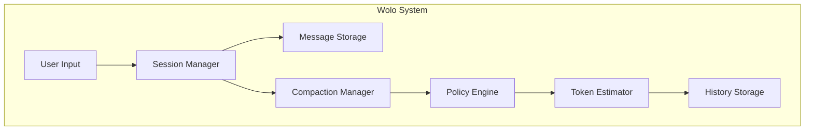
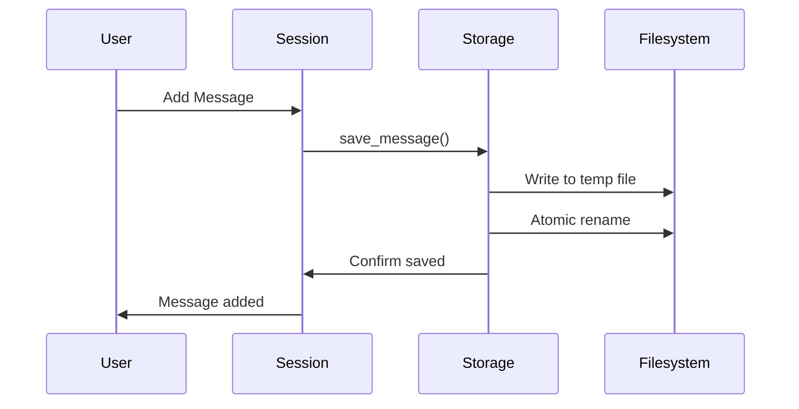
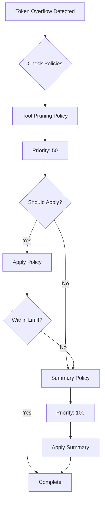
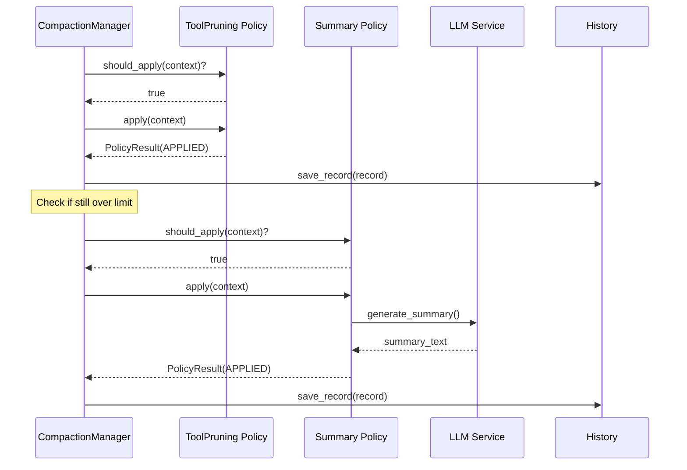
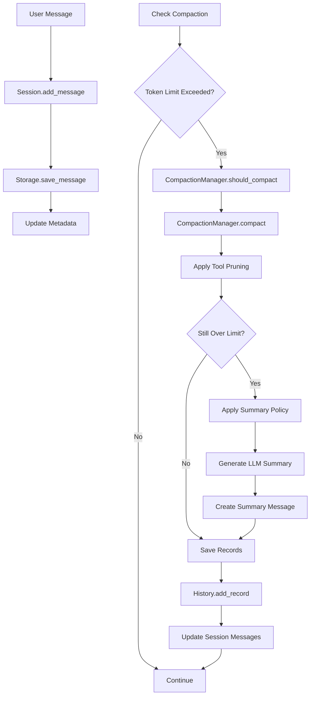
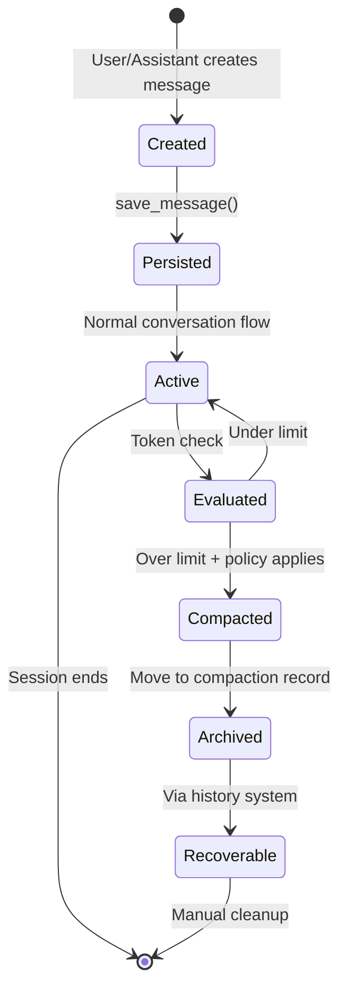

# Wolo Session Management and History Compaction Architecture

## Table of Contents

1. [Overview](#overview)
2. [Data Structures](#data-structures)
3. [Session Storage Architecture](#session-storage-architecture)
4. [History Management](#history-management)
5. [Compaction System](#compaction-system)
6. [Token Estimation](#token-estimation)
7. [Policy System](#policy-system)
8. [Data Flow Diagrams](#data-flow-diagrams)
9. [Persistence Strategy](#persistence-strategy)
10. [Error Handling](#error-handling)

## Overview

The Wolo system implements a sophisticated session management and history compaction architecture designed to handle long conversations efficiently while maintaining data integrity and supporting recovery. The system consists of three main components:

1. **Session Management**: Persistent storage of conversations with immediate persistence
2. **History Compaction**: Intelligent compression of conversation history when token limits are exceeded
3. **Token Estimation**: Efficient token counting for planning and decision-making



## Data Structures

### Core Message Types

```python
@dataclass
class Part:
    id: str
    type: str

@dataclass
class TextPart(Part):
    text: str = ""

@dataclass
class ToolPart(Part):
    tool: str
    input: dict[str, Any]
    output: str = ""
    status: str = "pending"
    start_time: float = 0.0
    end_time: float = 0.0
```

### Message Structure

```python
@dataclass
class Message:
    id: str
    role: str  # "user" or "assistant"
    parts: list[Part]
    timestamp: float
    finished: bool = False
    finish_reason: str = ""
    reasoning_content: str = ""  # GLM thinking mode
    metadata: dict[str, Any] = field(default_factory=dict)
```

### Session Structure

```python
@dataclass
class Session:
    id: str
    messages: list[Message] = field(default_factory=list)
    created_at: float = field(default_factory=time.time)
    parent_session_id: str | None = None
    agent_type: str | None = None
    title: str | None = None
    tags: list[str] = field(default_factory=list)
    updated_at: float = field(default_factory=time.time)
```

## Session Storage Architecture

The system uses a **layered storage architecture** with immediate persistence to prevent data loss:

### Directory Structure

```
~/.wolo/sessions/{session_id}/
├── session.json          # Session metadata
├── messages/
│   ├── {msg_id1}.json    # Individual message files
│   ├── {msg_id2}.json
│   └── ...
├── todos.json            # Todos state
├── compaction/
│   ├── records.json      # Compaction index
│   ├── {record_id}.json  # Individual records
│   └── ...
└── watch.sock            # Watch server socket
```

### Storage Features

1. **Atomic Writes**: Uses temporary files and atomic rename operations
2. **File Locking**: fcntl-based locking for concurrent access safety
3. **Immediate Persistence**: Every message is saved immediately upon creation/modification
4. **Graceful Recovery**: System can recover from crashes with minimal data loss



### Process Management

The system tracks running processes to prevent conflicts:

```python
def check_and_set_session_pid(session_id: str) -> bool:
    """Check if session has running process, set PID if not"""
    metadata = get_session_metadata(session_id)
    stored_pid = metadata.get("pid")
    
    if stored_pid and _is_wolo_process_running(stored_pid):
        return False  # Process already running
    
    # Set current PID
    update_session_metadata(session_id, pid=os.getpid())
    return True
```

## History Management

The compaction history system provides **complete auditability** and **recovery capabilities**:

### CompactionRecord Structure

```python
@dataclass(frozen=True)
class CompactionRecord:
    id: str                              # Unique record ID
    session_id: str                      # Session this belongs to
    policy: PolicyType                   # Policy that was applied
    created_at: float                    # Timestamp
    
    # Token statistics
    original_token_count: int            # Before compaction
    result_token_count: int              # After compaction
    original_message_count: int          # Message counts
    result_message_count: int
    
    # Message tracking
    compacted_message_ids: tuple[str, ...] # Messages that were compacted
    preserved_message_ids: tuple[str, ...] # Messages that were kept
    summary_message_id: str | None         # ID of summary message
    
    # Content and config
    summary_text: str                    # Generated summary
    config_snapshot: dict[str, Any]      # Config at time of compaction
```

### History Storage Strategy

1. **Lightweight Index**: `records.json` contains metadata for fast listing
2. **Detailed Records**: Individual record files contain full compaction details
3. **Message Recovery**: Original messages can be recovered from storage using message IDs

```mermaid
graph TD
    A[Compaction Event] --> B[Create CompactionRecord]
    B --> C[Store Full Record]
    B --> D[Update Index]
    C --> E[{record_id}.json]
    D --> F[records.json]
    
    G[Recovery Request] --> F
    F --> H[Load Record IDs]
    H --> E
    E --> I[Load Full Record]
    I --> J[Recover Original Messages]
```

## Compaction System

The compaction system uses a **strategy-based architecture** with multiple policies applied in priority order.

### Compaction Decision Flow

```python
@dataclass(frozen=True)
class CompactionDecision:
    should_compact: bool                 # Whether compaction is needed
    reason: str                         # Human-readable explanation
    current_tokens: int                 # Current usage
    limit_tokens: int                   # Token limit
    overflow_ratio: float               # current/limit ratio
    applicable_policies: tuple[PolicyType, ...] # Available policies
```

### Compaction Manager Algorithm

```python
async def compact(messages: list[Message], session_id: str) -> CompactionResult:
    """
    1. Check if compaction is enabled and needed
    2. Apply policies in priority order until within limits
    3. Record all compaction operations
    4. Return consolidated result
    """
    current_messages = tuple(messages)
    records = []
    policies_applied = []
    
    for policy in sorted_policies:
        if current_tokens <= limit_tokens:
            break
            
        if policy.should_apply(context):
            result = await policy.apply(context)
            if result.status == APPLIED:
                current_messages = result.messages
                records.append(result.record)
                policies_applied.append(policy.policy_type)
```

### Policy Priority System



## Token Estimation

The system uses **character-based heuristics** for efficient token estimation without requiring actual tokenization:

### Token Estimation Algorithm

```python
class TokenEstimator:
    CHARS_PER_TOKEN_ENGLISH: float = 4.0
    CHARS_PER_TOKEN_CHINESE: float = 1.5
    MESSAGE_OVERHEAD_TOKENS: int = 10
    TOOL_CALL_BASE_OVERHEAD: int = 20

    @classmethod
    def estimate_text(cls, text: str) -> int:
        chinese_count = sum(1 for c in text if cls.is_chinese_char(c))
        other_count = len(text) - chinese_count
        
        chinese_tokens = chinese_count / cls.CHARS_PER_TOKEN_CHINESE
        other_tokens = other_count / cls.CHARS_PER_TOKEN_ENGLISH
        
        return int(chinese_tokens + other_tokens)
```

### Estimation Accuracy

- **English text**: ~4 characters per token (±20% error)
- **Chinese text**: ~1.5 characters per token (±20% error)
- **Mixed text**: Weighted average based on character distribution
- **Tool calls**: Base overhead + JSON serialized input/output

## Policy System

The policy system implements the **Strategy Pattern** for pluggable compaction algorithms:

### Abstract Policy Interface

```python
class CompactionPolicy(ABC):
    @property
    @abstractmethod
    def name(self) -> str: ...
    
    @property
    @abstractmethod
    def policy_type(self) -> PolicyType: ...
    
    @property
    @abstractmethod
    def priority(self) -> int: ...
    
    @abstractmethod
    def should_apply(self, context: CompactionContext) -> bool: ...
    
    @abstractmethod
    async def apply(self, context: CompactionContext) -> PolicyResult: ...
```

### Built-in Policies

#### 1. Tool Output Pruning Policy

- **Priority**: 50 (applied first)
- **Strategy**: Selectively removes old tool outputs while preserving recent ones
- **Configuration**: 
  - `protect_recent_turns`: Number of recent turns to protect
  - `protect_token_threshold`: Token threshold before pruning
  - `protected_tools`: Tools that should never be pruned

#### 2. Summary Compaction Policy

- **Priority**: 100 (applied after pruning)
- **Strategy**: Summarizes older conversation using LLM while keeping recent exchanges
- **Configuration**:
  - `recent_exchanges_to_keep`: Number of recent exchanges to preserve
  - `summary_max_tokens`: Maximum tokens for summary
  - `include_tool_calls_in_summary`: Include tool usage in summary

### Policy Application Flow



## Data Flow Diagrams

### Complete System Data Flow



### Message Lifecycle



## Persistence Strategy

The system employs **aggressive persistence** to ensure data safety:

### Immediate Persistence

1. **Every message is saved immediately** upon creation or modification
2. **Session metadata is updated** with every change
3. **Compaction records are persisted** before applying changes
4. **Atomic operations** prevent partial writes

### Debounced Session Saving

For performance optimization, the system includes a debounced session saver:

```python
class SessionSaver:
    MIN_SAVE_INTERVAL = 0.5  # seconds
    
    def save(self, force: bool = False) -> None:
        now = time.time()
        if force or (now - self.last_save_time) >= self.MIN_SAVE_INTERVAL:
            self._do_save()
            self.pending_save = False
        else:
            self.pending_save = True
```

### Recovery Mechanisms

1. **Process PID tracking**: Prevents multiple processes from accessing same session
2. **File locking**: Prevents concurrent access issues
3. **Compaction history**: Allows recovery of original messages
4. **Graceful degradation**: System continues working even if some operations fail

## Error Handling

The system implements comprehensive error handling at multiple levels:

### Storage Layer Errors

- **File lock timeouts**: Gracefully handle concurrent access
- **Disk space issues**: Clean error messages and fallback options
- **JSON corruption**: Validation and recovery procedures

### Compaction Errors

- **LLM service failures**: Fallback to simple text-based summaries
- **Policy failures**: Continue with next policy in chain
- **Token estimation errors**: Conservative estimates and bounds checking

### Recovery Strategies

```python
try:
    result = await policy.apply(context)
    if result.status == FAILED:
        logger.warning(f"Policy {policy.name} failed: {result.error}")
        # Continue to next policy
except Exception as e:
    return PolicyResult(status=FAILED, error=str(e))
```

## Configuration

The system is highly configurable with sensible defaults:

```yaml
compaction:
  enabled: true
  auto_compact: true
  check_interval_steps: 3
  overflow_threshold: 0.9
  reserved_tokens: 2000
  
  summary_policy:
    enabled: true
    recent_exchanges_to_keep: 6
    summary_max_tokens: null
    include_tool_calls_in_summary: true
    
  tool_pruning_policy:
    enabled: true
    protect_recent_turns: 2
    protect_token_threshold: 40000
    minimum_prune_tokens: 20000
    protected_tools: []
    replacement_text: "[Output pruned to save context space]"
    
  policy_priority:
    tool_pruning: 50
    summary: 100
```

## Best Practices

### For Session Management

1. **Always check PID** before starting new session processes
2. **Use immediate persistence** for critical data
3. **Implement graceful shutdown** with pending save flush
4. **Monitor disk space** and implement cleanup policies

### For Compaction

1. **Configure appropriate token limits** based on model capabilities
2. **Test compaction policies** with representative data
3. **Monitor compaction effectiveness** through history records
4. **Plan for recovery scenarios** using compaction history

### For Performance

1. **Use token estimation** for planning rather than actual tokenization
2. **Implement debounced saving** for high-frequency updates
3. **Cache frequently accessed data** in memory
4. **Consider parallel policy execution** for large sessions

This architecture provides a robust, scalable, and maintainable foundation for handling long conversations while preserving data integrity and supporting recovery operations.